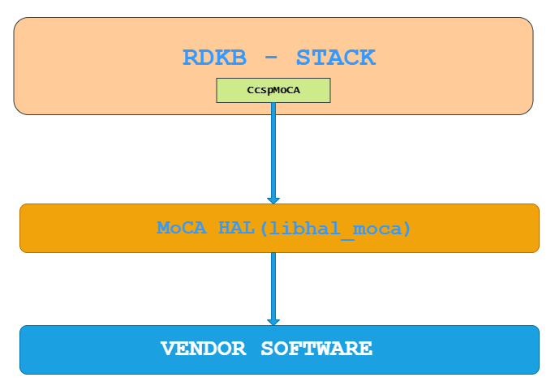
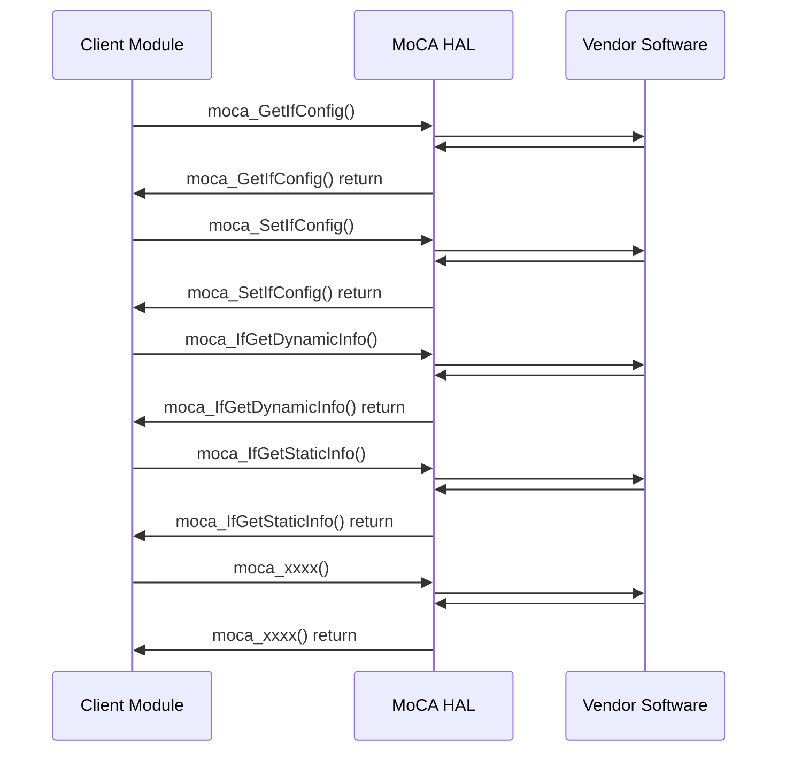

# MoCA HAL Documentation

## Acronyms

- `HAL` \- Hardware Abstraction Layer
- `RDK-B` \- Reference Design Kit for Broadband Devices
- `OEM` \- Original Equipment Manufacture
- `MoCA` \- Multimedia over Coax Alliance

# Description

The diagram below describes a high-level software architecture of the MoCA HAL module stack.



MoCA HAL is an abstraction layer, implemented to interacting with MoCA driver on CPE to get/set the specific details such as MoCA configurations, Interface informations such as static and dynamic, Associated Device informations, Get list of all the Nodes Connected on MoCA Network, etc. This HAL layer will be used by the CcspMoCA component currently.

# Component Runtime Execution Requirements

## Initialization and Startup

RDK-B MoCA HAL is to initialize the MoCA interface on the device. This involves opening the MoCA interface and configuring its settings, such as the frequency band, channel selection, and encryption settings. The HAL provides a set of APIs that allow the developer to interact with the MoCA hardware and configure the interface.

The below HAL API's are not called on bootup but the below API's are used at runtime whenever need it. Only few API's are listed here, Please refer the doxygen of MoCA HAL pages for detailed API's.

- `moca_GetIfConfig()`
- `moca_SetIfConfig()`
- `moca_IfGetDynamicInfo()`
- `moca_IfGetStaticInfo()`
- `moca_IfGetStats()`
- `moca_GetNumAssociatedDevices()`
- `moca_FreqMaskToValue()`

It is upto the 3rd party vendors to handle it appropriately to meet operational requirements. Failure to meet these requirements will likely result in undefined and unexpected behaviour.

## Theory of operation

Broadband MoCA HAL is to provide a standardized interface that allows developers to easily interact with MoCA hardware on their device. By abstracting the low-level details of the MoCA hardware, the HAL simplifies the development process and allows developers to focus on the application logic rather than the details of the hardware. Additionally, the HAL provides tools for monitoring and debugging the MoCA interface, which helps ensure that the MoCA network is operating correctly.

## Threading Model

MoCA HAL is not thread safe, any module which is invoking the MoCA HAL api should ensure calls are made in a thread safe manner.

Different 3rd party vendors allowed to create internal threads to meet the operational requirements. In this case 3rd party implementations
should be responsible to synchronize between the calls, events and cleanup the thread.

## Memory Model

MoCA HAL client module is responsible to allocate and deallocate memory for necessary API's to store information as specified in API Documentation.

Different 3rd party vendors allowed to allocate memory for internal operational requirements. In this case 3rd party implementations should be responsible to deallocate internally.

## Power Management Requirements

The MoCA HAL is not involved in any of the power management operation. Any power management state transitions MUST not affect the operation of the MoCA HAL.

## Asynchronous Notification Model
None

## Blocking calls

MoCA HAL API's are expected to work synchronously and should complete within a time period commensurate with the complexity of the operation and in accordance with any relevant specification.

Any calls that can fail due to the lack of a response should have a timeout period in accordance with any relevant documentation.

## Internal Error Handling

All the MoCA HAL API's should return error synchronously as a return argument. HAL is responsible to handle system errors(e.g. out of memory) internally.

## Persistence Model

There is no requirement for HAL to persist any setting information. Application/Client is responsible to persist any settings related to their implementation.

# Nonfunctional requirements

Following non functional requirement should be supported by the MoCA HAL component.

## Logging and debugging requirements

MoCA HAL component should log all the error and critical informative messages which helps to debug/triage the issues and understand the functional flow of the system.

## Memory and performance requirements

Make sure MoCA HAL is not contributing more to memory and CPU utilization while performing normal operations and Commensurate with the operation required.

## Quality Control

MoCA HAL implementation should pass Coverity, Black duck scan, valgrind checks without any issue. There should not be any memory leaks/corruption introduced by HAL and underneath 3rd party software implementation.

## Licensing

MoCA HAL implementation is expected to released under the Apache License.

## Build Requirements

MoCA HAL source code should be build under Linux Yocto environment and should be delivered as a static library libhal_moca.

## Variability Management

Any new API introduced should be implemented by all the 3rd party module and RDK generic code should be compatible with specific version of MoCA HAL software

## MoCA HAL or Product Customization

The product can be configured via the following compile time defines:

```c
MOCA_VAR  #Disable the MoCA Variables
```

## Interface API Documentation

All HAL function prototypes and datatype definitions are available in moca_hal.h file.

1. Components/Process must include moca_hal.h to make use of moca hal capabilities.
2. Components/Process should add linker dependency for libhal_moca.

## Theory of operation and key concepts

Covered as per "Description" sections in the API documentation.

#### Sequence Diagram


