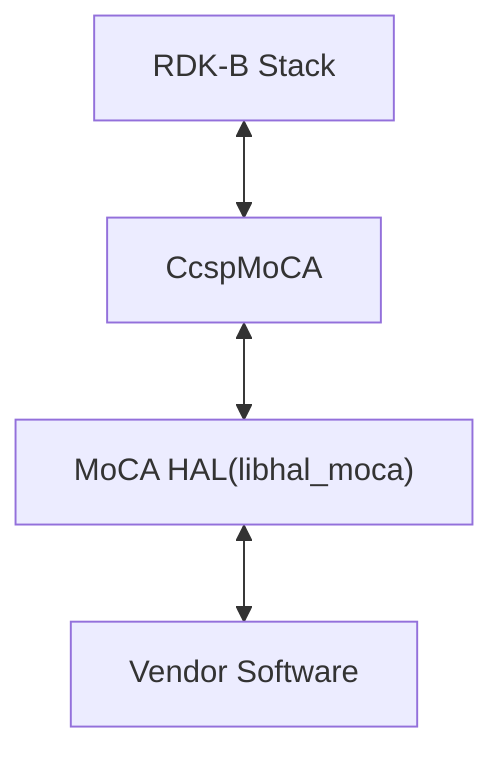
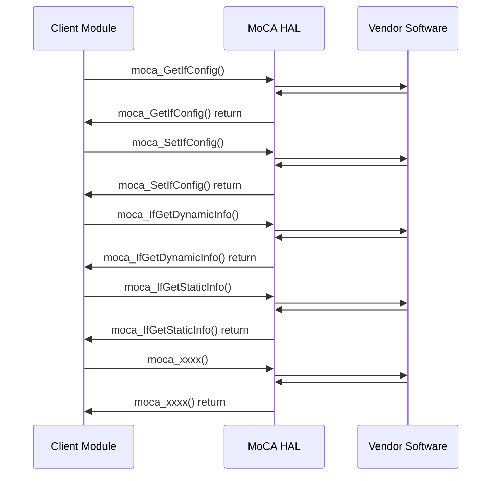

# MoCA HAL Documentation

## Acronyms

- `HAL` \- Hardware Abstraction Layer
- `RDK-B` \- Reference Design Kit for Broadband Devices
- `OEM` \- Original Equipment Manufacture
- `MoCA` \- Multimedia over Coax Alliance

## Description

The diagram below describes a high-level software architecture of the MoCA HAL module stack.

The MoCA (Multimedia over Coax Alliance) HAL (Hardware Abstraction Layer) is a component within the RDK-B (Reference Design Kit Broadband) framework designed to facilitate interaction with MoCA network adapters. Its primary purpose is to provide a standardized interface that allows higher-level software components to access and control MoCA functionalities, regardless of the specific underlying hardware or vendor implementation.

## Component Runtime Execution Requirements

### Initialization and Startup

RDK-B's MoCA Hardware Abstraction Layer (HAL) is responsible for setting up the MoCA interface on a device. This involves starting up the interface and adjusting its parameters, including frequency band, channel, and encryption settings. The HAL provides a collection of APIs that allow developers to interact with the MoCA hardware and manage the interface configuration.

- `moca_GetIfConfig()`
- `moca_SetIfConfig()`
- `moca_IfGetDynamicInfo()`
- `moca_IfGetStaticInfo()`
- `moca_IfGetStats()`
- `moca_GetNumAssociatedDevices()`
- `moca_FreqMaskToValue()`

Third party vendors will implement appropriately to meet operational requirements. This interface is expected to block if the hardware is not ready.

## Theory of operation

Broadband MoCA HAL serves as a standardized interface that simplifies developer interaction with MoCA hardware. By abstracting the underlying complexities of the MoCA hardware, the HAL streamlines development and enables developers to concentrate on application logic. Furthermore, the HAL offers tools for monitoring and troubleshooting the MoCA interface, ensuring optimal performance of the MoCA network.

## Threading Model

Vendors may implement internal threading and event mechanisms to meet their operational requirements. These mechanisms must be designed to ensure thread safety when interacting with HAL interface. Proper cleanup of allocated resources (e.g., memory, file handles, threads) is mandatory when the vendor software terminates or closes its connection to the HAL.

This interface is not inherently required to be thread-safe. It is the responsibility of the calling module or component to ensure that all interactions with the APIs are properly synchronized.

## Process Model

All APIs are expected to be called from multiple processes. Due to this concurrent access, vendors must implement protection mechanisms within their API implementations to handle multiple processes calling the same API simultaneously. This is crucial to ensure data integrity, prevent race conditions, and maintain the overall stability and reliability of the system.

## Memory Model

**Caller Responsibilities:**

- Manage memory passed to specific functions as outlined in the API documentation. This includes allocation and deallocation to prevent leaks.

**Module Responsibilities:**

- Modules must allocate and de-allocate memory for their internal operations, ensuring efficient resource management.
- Modules are required to release all internally allocated memory upon closure to prevent resource leaks.
- All module implementations and caller code must strictly adhere to these memory management requirements for optimal performance and system stability. Unless otherwise stated specifically in the API documentation.
- All strings used in this module must be zero-terminated. This ensures that string functions can accurately determine the length of the string and prevents buffer overflows when manipulating strings.

TODO:
State a footprint requirement. Example: This should not exceed XXXX KB.

## Power Management Requirements

The MoCA HAL is not involved in any of the power management operation. It does not participate in or require involvement in any power-related functions.

## Asynchronous Notification Model

This API is called from a single thread context, therefore is must not suspend.

## Blocking calls

**Synchronous and Responsive:** All APIs within this module should operate synchronously and complete within a reasonable timeframe based on the complexity of the operation. Specific timeout values or guidelines may be documented for individual API calls.

**Timeout Handling:** To ensure resilience in cases of unresponsiveness, implement appropriate timeouts for API calls where failure due to lack of response is a possibility. Refer to the API documentation for recommended timeout values per function.

**Non-Blocking Requirement:** Given the single-threaded environment in which these APIs will be called, it is imperative that they do not block or suspend execution of the main thread. Implementations must avoid long-running operations or utilize asynchronous mechanisms where necessary to maintain responsiveness.

TODO:
We are actively working on defining a specific timeout requirement for the completion of [task/process]. This target will align with any relevant specifications and be clearly documented in a future update.

## Internal Error Handling

**Synchronous Error Handling:** All APIs must return errors synchronously as a return value. This ensures immediate notification of errors to the caller.
**Internal Error Reporting:** The HAL is responsible for reporting any internal system errors (e.g., out-of-memory conditions) through the return value.
**Focus on Logging for Errors:** For system errors, the HAL should prioritize logging the error details for further investigation and resolution.

## Persistence Model

There is no requirement for HAL to persist any setting information. Application/Client is responsible to persist any settings related to their implementation.

# Nonfunctional requirements

Following non functional requirement should be supported by the MoCA HAL component.

## Logging and debugging requirements

The component is required to record all errors and critical informative messages to aid in identifying, debugging, and understanding the functional flow of the system. Logging should be implemented using the syslog method, as it provides robust logging capabilities suited for system-level software. The use of `printf` is discouraged unless `syslog` is not available.

All HAL components must adhere to a consistent logging process. When logging is necessary, it should be performed into the `moca_vendor_hal.log` file, which is located in either the `/var/tmp/` or `/rdklogs/logs/` directories.

Logs must be categorized according to the following log levels, as defined by the Linux standard logging system, listed here in descending order of severity:

- **FATAL:** Critical conditions, typically indicating system crashes or severe failures that require immediate attention.
- **ERROR:** Non-fatal error conditions that nonetheless significantly impede normal operation.
- **WARNING:** Potentially harmful situations that do not yet represent errors.
- **NOTICE:** Important but not error-level events.
- **INFO:** General informational messages that highlight system operations.
- **DEBUG:** Detailed information typically useful only when diagnosing problems.
- **TRACE:** Very fine-grained logging to trace the internal flow of the system.

Each log entry should include a timestamp, the log level, and a message describing the event or condition. This standard format will facilitate easier parsing and analysis of log files across different vendors and components.

## Memory and performance requirements

**Client Module Responsibility:** The client module using the HAL is responsible for allocating and deallocating memory for any data structures required by the HAL's APIs. This includes structures passed as parameters to HAL functions and any buffers used to receive data from the HAL.

**Vendor Implementation Responsibility:** Third-party vendors, when implementing the HAL, may allocate memory internally for their specific operational needs. It is the vendor's sole responsibility to manage and deallocate this internally allocated memory.

## Quality Control

To ensure the highest quality and reliability, it is strongly recommended that third-party quality assurance tools like `Coverity`, `Black Duck`, and `Valgrind` be employed to thoroughly analyze the implementation. The goal is to detect and resolve potential issues such as memory leaks, memory corruption, or other defects before deployment.

Furthermore, both the HAL wrapper and any third-party software interacting with it must prioritize robust memory management practices. This includes meticulous allocation, deallocation, and error handling to guarantee a stable and leak-free operation.

## Licensing

MoCA HAL implementation is expected to released under the Apache License 2.0

## Build Requirements

The source code should be capable of, but not be limited to, building under the Yocto distribution environment. The recipe should deliver a shared library named as `libhal_moca.so`.

## Variability Management

The role of adjusting the interface, guided by versioning, rests solely within architecture requirements. Thereafter, vendors are obliged to align their implementation with a designated version of the interface. As per Service Level Agreement (SLA) terms, they may transition to newer versions based on demand needs.

Each API interface will be versioned using [Semantic Versioning 2.0.0](https://semver.org/), the vendor code will comply with a specific version of the interface.

## MoCA HAL or Product Customization

When `MOCA_VAR` is defined in the provided header file, certain sections of the code are excluded from compilation. Here's what will happen:

**Exclusion of `moca_if_status_t` Enumeration:** This enumeration defines possible states for a MoCA interface, such as IF_STATUS_Up, IF_STATUS_Down, and others. When `MOCA_VAR` is defined, these states are not declared, which means that any code relying on these specific MoCA interface states will not compile.

**Exclusion of Dynamic Info Structure Definition:** The structure `moca_dynamic_info_t`, which contains dynamic information about a MoCA interface like its status, last change, max ingress and egress bandwidth, and so forth, is also excluded. This will affect the functionality that relies on obtaining or manipulating dynamic status information of MoCA interfaces.

**Exclusion of MoCA Mesh Table Definition and Function:** The `moca_mesh_table_t` structure and associated functions like `moca_GetFullMeshRates` that provide information on the PHY rates between nodes in a MoCA network are not available. This limitation means that the software will lack the capability to fetch or manipulate full mesh PHY rates when `MOCA_VAR` is defined.

These exclusions lead to a restricted set of functionalities related to interface status reporting, dynamic information management, and network-wide PHY rate information retrieval and handling.

## Interface API Documentation

The `moca_hal.h` header file provides a complete reference for all HAL function prototypes and data type definitions.

To utilize the MoCA HAL functionalities within your component or process:

1. **Inclusion:** Ensure to include the `moca_hal.h` header file in your source code.
2. **Linking:** Establish a linker dependency on the `libhal_moca` library.

## Theory of operation and key concepts

### Object Lifecycles

- **Creation:** The MoCA HAL itself does not explicitly create objects in the traditional sense. Instead, it provides an interface for interacting with the underlying MoCA hardware. Client modules are responsible for allocating memory for data structures like `moca_cfg_t` and `moca_stats_t` to receive information from the HAL.

- **Usage:** These structures are populated by the HAL's API functions (`moca_GetIfConfig`, `moca_IfGetDynamicInfo`, etc.). Client modules then use the information within these structures to configure the MoCA interface, monitor its status, and gather statistics.

- **Destruction:** Client modules are responsible for deallocating the memory they allocated for the data structures after they are no longer needed. The HAL itself does not manage the lifecycle of these objects.

- **Unique Identifiers:** The `ifIndex` parameter (an unsigned long) is used to identify specific MoCA interfaces. If a device has multiple MoCA interfaces, each would have a unique `ifIndex`. There are no other explicit unique identifiers for objects within the HAL.

### Method Sequencing

- **Initialization:** The MoCA interface must be initialized before any configuration or information retrieval functions can be called. This initialization involves opening the interface and applying default configurations.

- **Configuration:** Configuration functions like `moca_SetIfConfig` should generally be called before attempting to retrieve information or perform other operations.

- **Other Methods:** Most other functions (`moca_GetIfConfig`, `moca_IfGetDynamicInfo`, etc.) can be called in any order after initialization and configuration, as long as they are called from a single-threaded context due to the lack of thread safety.

### State-Dependent Behaviour

- **Interface Status:** Functions like `moca_GetIfDynamicInfo` and `moca_IfGetStats` will return different information depending on the current state of the MoCA interface (Up, Down, Dormant, etc.).

- **ACA Process:** Functions like `moca_setIfAcaConfig`, `moca_getIfAcaConfig`, and `moca_cancelIfAca` are specifically related to the Automatic Channel Assessment (ACA) process. They can only be used meaningfully when the ACA process is running or is being configured to start.

- **State Model:** While not explicitly documented, there is an implicit state model governing the MoCA interface (e.g., Up, Down, etc.) and the ACA process (e.g., Running, Not Running). The behaviour of certain functions will depend on these states.

## Sequence Diagram

